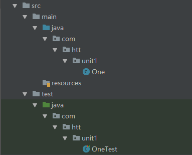

#Explain
1. 这是专门学习算法的一个仓库，系统的学习算法（第四版）
2. 根据学习进度及时总结经验教训以及练习算法
3. 算法题直接按照该算法出现的顺序以英文数字（比如One）来表示类名，
   算法名同算法示例中给出的算法名（比如第一个算法是 gcd(int p,int q))
   
       public class One
       {
       
           public static int gcd(int p, int q)
           {
               if (q == 0)
               {
                   return p;
               }
               int r = p % q;
               return gcd(q, r);
           }
       }
4. 每个单元一个包名（比如第一单元的包名是unit1)
5. 每个单元一个README.md文档，总结下学习过程以及收获和感悟，同时如果学习过程中有感想也可以在当前算法的注释区进行总结和记录
   以便于查看和回顾
6. 每个算法的test 会单独生成对应的junit test 下图是整个项目的结构

